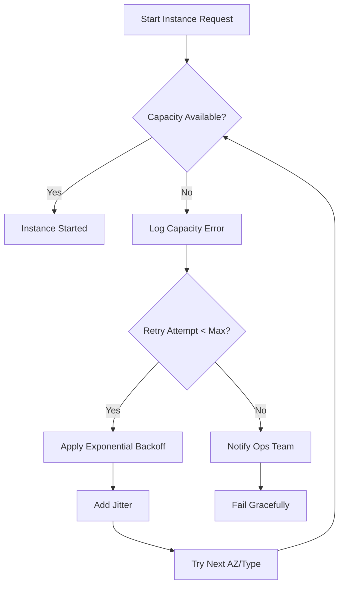

# On-Demand Instance Availability Strategy for AWS Schedulers

## Executive Summary

This document outlines tactical strategies to handle on-demand instance unavailability issues when starting EC2, EKS managed nodes, and RDS instances. The proposed solutions focus on immediate implementable strategies without requiring Reserved Instances or Savings Plans.

## Problem Statement

When attempting to start on-demand instances in AWS, we may encounter `InsufficientInstanceCapacity` errors, indicating that AWS doesn't have available capacity for the requested instance type in the specified Availability Zone. This can cause service disruptions and failed scaling operations.

### Current State Analysis

Based on codebase analysis:
- **No existing retry mechanisms** for capacity errors
- **No multi-AZ fallback** strategies
- **No instance type flexibility** 
- **Basic error handling only** for generic AWS errors
- **Fixed instance types** hardcoded in configurations

## Research: AWS Best Practices

### 1. AWS Recommendations

According to AWS documentation and best practices:

- **Use multiple Availability Zones**: Distribute instances across AZs
- **Implement retry logic**: Use exponential backoff with jitter
- **Instance type flexibility**: Use multiple instance types that meet requirements
- **Capacity Reservations**: Not applicable (requires upfront commitment)
- **Spot Instances as fallback**: Not suitable for production workloads

### 2. Common Error Codes

```
- InsufficientInstanceCapacity
- InstanceLimitExceeded  
- InsufficientFreeAddressesInSubnet
- InsufficientVolumeCapacity
```

### 3. Industry Patterns

- **Netflix**: Uses predictive scaling and multi-region deployment
- **Airbnb**: Implements instance type flexibility with performance tiers
- **Uber**: Uses capacity pooling across multiple accounts

## Proposed Solution Architecture

### 1. Multi-Tier Retry Strategy

```python
class CapacityRetryStrategy:
    def __init__(self):
        self.retry_delays = [5, 10, 30, 60, 120, 300]  # seconds
        self.max_retries = 6
        self.jitter_range = 0.2  # 20% randomization
```

#### Retry Logic Flow



### 2. Availability Zone Fallback Strategy

#### Priority-Based AZ Selection

```json
{
  "ap-southeast-2": {
    "priority_azs": [
      "ap-southeast-2b",  // Primary - historically most available
      "ap-southeast-2a",  // Secondary
      "ap-southeast-2c"   // Tertiary
    ],
    "blacklist_window": 300,  // 5 minutes
    "success_tracking": true
  }
}
```

#### Implementation Design

1. **AZ Health Scoring**
   - Track success/failure rates per AZ
   - Maintain rolling 24-hour window
   - Dynamically adjust priorities

2. **Subnet Mapping**
   - Maintain AZ-to-subnet mappings
   - Ensure security group compatibility
   - Validate route table associations

### 3. Instance Type Flexibility Matrix

#### Equivalence Groups

| Primary Type | Fallback Priority 1 | Fallback Priority 2 | Fallback Priority 3 |
|--------------|-------------------|-------------------|-------------------|
| m5.large | m5a.large | m6i.large | m4.large |
| m5.xlarge | m5a.xlarge | m6i.xlarge | m5n.xlarge |
| c5.large | c5a.large | c6i.large | c5n.large |
| r5.large | r5a.large | r6i.large | r4.large |
| t3.medium | t3a.medium | t2.medium | t3.large |

#### Selection Criteria

1. **Performance Compatibility**
   - CPU architecture (x86_64, arm64)
   - Network performance tier
   - EBS optimization support

2. **Cost Optimization**
   - Maximum 20% cost increase threshold
   - Prefer same generation types
   - Consider Spot pricing as last resort

### 4. Intelligent Capacity Pre-Check

#### Pre-Launch Validation

```python
def check_capacity_availability(instance_type, az):
    # Check Service Quotas
    quotas = service_quotas.get_service_quota(
        ServiceCode='ec2',
        QuotaCode=f'L-{instance_type_quota_code}'
    )
    
    # Check instance type offerings
    offerings = ec2.describe_instance_type_offerings(
        Filters=[
            {'Name': 'instance-type', 'Values': [instance_type]},
            {'Name': 'location', 'Values': [az]}
        ]
    )
    
    # Check recent capacity errors (from CloudWatch)
    recent_errors = get_capacity_errors(instance_type, az, hours=24)
    
    return {
        'quota_available': quotas['Value'] > current_usage,
        'type_offered': len(offerings['InstanceTypeOfferings']) > 0,
        'recent_failures': recent_errors,
        'confidence_score': calculate_confidence(quotas, offerings, recent_errors)
    }
```

### 5. Staggered Instance Launch Pattern

#### Batch Processing Design

```python
class StaggeredLauncher:
    def __init__(self, total_instances):
        self.total = total_instances
        self.batch_sizes = self._calculate_batches()
        
    def _calculate_batches(self):
        if self.total <= 5:
            return [self.total]
        elif self.total <= 20:
            return [5] * (self.total // 5) + ([self.total % 5] if self.total % 5 else [])
        else:
            # Start small, increase batch size
            return [2, 3, 5, 10] + [10] * ((self.total - 20) // 10)
```

#### Benefits
- Reduces simultaneous capacity requests
- Allows early failure detection
- Enables partial success scenarios

### 6. Monitoring and Alerting Strategy

#### CloudWatch Metrics

```yaml
Custom Metrics:
  - InstanceLaunchAttempts
  - InstanceLaunchFailures
  - CapacityErrorsByAZ
  - CapacityErrorsByType
  - RetrySuccessRate
  - FallbackTypeUsage

Alarms:
  - CapacityErrorRate > 10% (Warning)
  - CapacityErrorRate > 25% (Critical)
  - ConsecutiveFailures > 3 (Page on-call)
```

#### Logging Enhancement

```python
{
    "timestamp": "2025-01-17T10:30:45Z",
    "event": "capacity_error",
    "details": {
        "instance_type": "m5.large",
        "availability_zone": "ap-southeast-2a",
        "error_code": "InsufficientInstanceCapacity",
        "retry_attempt": 1,
        "fallback_type": "m5a.large",
        "fallback_az": "ap-southeast-2b"
    }
}
```

## Implementation Roadmap

### Phase 1: Immediate (Week 1-2)
1. **Basic Retry Logic**
   - Implement exponential backoff with jitter
   - Add capacity error detection
   - Create retry configuration

2. **Error Handling Enhancement**
   - Add specific handling for `InsufficientInstanceCapacity`
   - Implement proper logging
   - Create SNS notifications for failures

### Phase 2: Short-term (Week 3-4)
1. **Multi-AZ Fallback**
   - Implement AZ priority logic
   - Add subnet mapping management
   - Create AZ health tracking

2. **Instance Type Flexibility**
   - Define equivalence groups
   - Implement type selection logic
   - Add cost validation

### Phase 3: Medium-term (Week 5-6)
1. **Capacity Pre-checks**
   - Integrate Service Quotas API
   - Add instance offering validation
   - Implement confidence scoring

2. **Monitoring Dashboard**
   - Create CloudWatch dashboard
   - Set up automated alerts
   - Build capacity analytics

## Configuration Examples

### 1. Retry Configuration
```ini
[capacity_retry]
enabled = true
max_retries = 6
base_delay = 5
max_delay = 300
jitter_factor = 0.2
backoff_multiplier = 2
```

### 2. Instance Flexibility Configuration
```json
{
  "instance_flexibility": {
    "enabled": true,
    "max_cost_increase_percent": 20,
    "fallback_groups": {
      "m5_family": ["m5.large", "m5a.large", "m6i.large", "m5n.large"],
      "c5_family": ["c5.large", "c5a.large", "c6i.large", "c5n.large"],
      "r5_family": ["r5.large", "r5a.large", "r6i.large", "r5n.large"]
    }
  }
}
```

### 3. AZ Priority Configuration
```json
{
  "availability_zones": {
    "ap-southeast-2": {
      "priorities": {
        "production": ["2b", "2a", "2c"],
        "development": ["2a", "2c", "2b"]
      },
      "health_tracking": true,
      "blacklist_duration_seconds": 300
    }
  }
}
```

## Testing Strategy

### 1. Unit Tests
- Mock `InsufficientInstanceCapacity` errors
- Validate retry logic with different delays
- Test AZ fallback sequencing
- Verify instance type selection

### 2. Integration Tests
- Use test account with limited capacity
- Simulate multi-AZ failures
- Validate end-to-end retry behavior
- Test partial success scenarios

### 3. Chaos Engineering
- Randomly inject capacity errors
- Test during peak usage times
- Validate monitoring and alerting
- Measure recovery times

## Risk Mitigation

### 1. Performance Impact
- **Risk**: Retries increase start time
- **Mitigation**: Implement aggressive timeouts, parallel attempts

### 2. Cost Overruns
- **Risk**: Fallback types may cost more
- **Mitigation**: Set cost increase limits, track usage

### 3. Configuration Complexity
- **Risk**: Complex fallback rules
- **Mitigation**: Provide sensible defaults, validation tools

## Success Metrics

1. **Availability Metrics**
   - Instance start success rate > 99.5%
   - Mean time to successful start < 3 minutes
   - Capacity error resolution rate > 95%

2. **Operational Metrics**
   - False positive alerts < 5%
   - Configuration errors < 1%
   - Manual intervention rate < 10%

3. **Cost Metrics**
   - Average cost increase < 5%
   - Fallback type usage < 20%
   - Wasted capacity < 2%

## Conclusion

This comprehensive strategy provides multiple layers of resilience against on-demand instance capacity issues. By implementing these tactical solutions, we can achieve high availability without committing to Reserved Instances or Savings Plans. The phased approach allows for incremental improvements while maintaining system stability.

## Appendix: Code Templates

### A. Retry Handler Template
```python
import time
import random
from typing import Optional, Dict, Any
import logging

class CapacityRetryHandler:
    def __init__(self, config: Dict[str, Any]):
        self.max_retries = config.get('max_retries', 6)
        self.base_delay = config.get('base_delay', 5)
        self.max_delay = config.get('max_delay', 300)
        self.jitter_factor = config.get('jitter_factor', 0.2)
        self.logger = logging.getLogger(__name__)
        
    def with_retry(self, func, *args, **kwargs):
        for attempt in range(self.max_retries):
            try:
                return func(*args, **kwargs)
            except ClientError as e:
                if e.response['Error']['Code'] == 'InsufficientInstanceCapacity':
                    if attempt < self.max_retries - 1:
                        delay = self._calculate_delay(attempt)
                        self.logger.warning(
                            f"Capacity error on attempt {attempt + 1}, "
                            f"retrying in {delay}s"
                        )
                        time.sleep(delay)
                    else:
                        raise
                else:
                    raise
                    
    def _calculate_delay(self, attempt: int) -> float:
        delay = min(self.base_delay * (2 ** attempt), self.max_delay)
        jitter = delay * self.jitter_factor * (2 * random.random() - 1)
        return delay + jitter
```

### B. AZ Fallback Template
```python
class AZFallbackStrategy:
    def __init__(self, region: str):
        self.region = region
        self.az_priorities = self._load_az_priorities()
        self.az_health = {}  # Track success rates
        
    def get_next_az(self, failed_azs: List[str]) -> Optional[str]:
        for az in self.az_priorities:
            if az not in failed_azs:
                if self._is_az_healthy(az):
                    return az
        return None
        
    def record_result(self, az: str, success: bool):
        if az not in self.az_health:
            self.az_health[az] = {'success': 0, 'failure': 0}
        
        if success:
            self.az_health[az]['success'] += 1
        else:
            self.az_health[az]['failure'] += 1
```