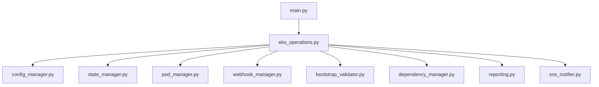
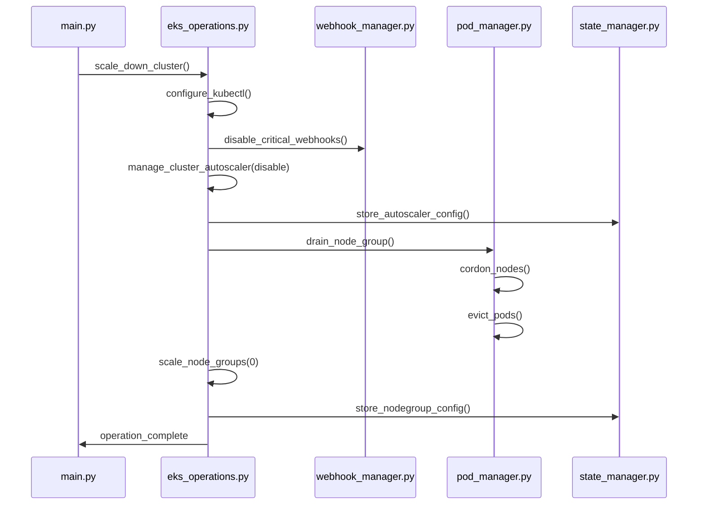
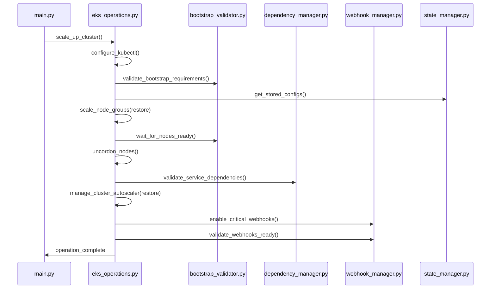

# EKS Scheduler - Comprehensive Documentation

## Table of Contents

1. [Overview](#overview)
2. [Architecture](#architecture)
3. [Core Modules](#core-modules)
4. [Configuration](#configuration)
5. [Operational Flows](#operational-flows)
6. [Fallback Mechanisms](#fallback-mechanisms)
7. [Error Handling](#error-handling)
8. [Usage Examples](#usage-examples)
9. [Troubleshooting](#troubleshooting)
10. [Best Practices](#best-practices)

## Overview

The EKS Scheduler is a production-grade AWS resource scheduler designed for cost optimization through automated EKS cluster scaling. It provides sophisticated state management, phased execution, and comprehensive safety features to ensure zero-downtime operations.

### Key Features

- **Safe Cluster Scaling**: Graceful pod eviction with PodDisruptionBudget compliance
- **Autoscaler Conflict Resolution**: Prevents autoscaler interference during manual scaling
- **Webhook Management**: Handles admission controllers to prevent deployment failures
- **Bootstrap Validation**: Prevents deadlock scenarios when scaling from zero nodes
- **Dependency Orchestration**: Ensures proper service startup order
- **State Preservation**: Maintains cluster configurations between scale operations
- **Comprehensive Dry-Run**: Full simulation capabilities for safe testing

## Architecture

The EKS scheduler follows a modular architecture with clear separation of concerns:

```
eks-scheduler/
├── src/
│   ├── main.py                    # Main orchestrator and entry point
│   ├── eks_operations.py          # Core EKS operations handler
│   ├── config_manager.py          # Configuration management
│   ├── state_manager.py           # State persistence handler
│   ├── pod_manager.py             # Pod lifecycle management
│   ├── webhook_manager.py         # Admission webhook management
│   ├── bootstrap_validator.py     # Bootstrap validation
│   ├── dependency_manager.py      # Service dependency orchestration
│   ├── reporting.py               # Report generation
│   └── sns_notifier.py            # AWS SNS notifications
├── config/
│   ├── config.ini                 # Service configuration
│   └── accounts.json              # Account definitions (legacy)
├── state/                         # Runtime state files (created automatically)
├── reports/                       # Generated reports (created automatically)
└── tests/                         # Unit tests
```

### Data Flow



## Core Modules

### 1. main.py - Main Orchestrator

**Purpose**: Entry point, argument parsing, and workflow coordination

**Key Functions**:
- Command-line argument parsing
- Logging infrastructure setup
- Account and cluster processing
- Report generation coordination
- SNS notification handling

**Command-line Arguments**:
```bash
python main.py --action {start|stop} --cluster CLUSTER_NAME [OPTIONS]
```

### 2. eks_operations.py - Core Operations Handler

**Purpose**: Main EKS operations with integrated safety features

**Key Methods**:
- `scale_down_cluster()` - Enhanced scale down with safety checks
- `scale_up_cluster()` - Enhanced scale up with validation
- `manage_cluster_autoscaler()` - Autoscaler conflict resolution
- `configure_kubectl()` - Cluster access configuration

**Scale Down Flow**:
1. Configure kubectl access
2. Disable critical webhooks
3. Disable cluster autoscaler
4. Gracefully drain pods from nodes
5. Scale node groups to 0
6. Store original configurations

**Scale Up Flow**:
1. Configure kubectl access
2. Validate bootstrap requirements
3. Scale up node groups
4. Wait for nodes to be ready
5. Uncordon nodes
6. Validate system dependencies
7. Restore cluster autoscaler
8. Re-enable critical webhooks
9. Final webhook readiness validation

### 3. config_manager.py - Configuration Management

**Purpose**: Centralized configuration handling with environment overrides

**Key Features**:
- INI file parsing
- Environment variable overrides
- Configuration validation
- Timeout management
- Webhook configuration parsing

### 4. state_manager.py - State Persistence

**Purpose**: Maintains cluster state between scale operations

**State Files** (JSON format in `state/` directory):
- `{cluster_name}_nodegroups.json` - Node group configurations
- `{cluster_name}_autoscaler.json` - Autoscaler state

**Key Methods**:
- `store_nodegroup_config()` - Save node group settings
- `get_stored_configs()` - Retrieve saved configurations
- `store_autoscaler_config()` - Save autoscaler state
- `clear_stored_configs()` - Cleanup after operations

### 5. pod_manager.py - Pod Lifecycle Management

**Purpose**: Graceful pod eviction and node management

**Key Features**:
- Node cordoning and uncordoning
- Graceful pod eviction with timeouts
- PodDisruptionBudget compliance
- Configurable grace periods
- Force termination as fallback

**Process Flow**:
1. Identify nodes in node group
2. Cordon nodes (mark as unschedulable)
3. Evict pods with grace period
4. Wait for pod termination
5. Force terminate if necessary

### 6. webhook_manager.py - Admission Webhook Management

**Purpose**: Manages admission controllers during scaling operations

**Supported Webhooks**:
- Kyverno (policy and resource webhooks)
- AWS Load Balancer Controller
- Cert-Manager
- Istio
- OPA Gatekeeper

**Operations**:
- `disable_critical_webhooks()` - Temporarily disable during scale-down
- `enable_critical_webhooks()` - Re-enable after scale-up
- `validate_webhooks_ready()` - Ensure webhooks are healthy

### 7. bootstrap_validator.py - Bootstrap Validation

**Purpose**: Prevents cluster deadlock scenarios

**Validations**:
- Minimum node requirements for system pods
- CoreDNS availability
- Kube-proxy functionality
- Node readiness checks
- System pod health validation

### 8. dependency_manager.py - Service Dependency Orchestration

**Purpose**: Ensures proper service startup order in 7 tiers

**Dependency Tiers**:
1. **core-kubernetes**: CoreDNS, kube-proxy
2. **infrastructure**: EBS CSI, VPC CNI, Load Balancer Controller
3. **cluster-management**: Cluster Autoscaler, Metrics Server
4. **admission-control**: Kyverno, OPA Gatekeeper
5. **service-mesh**: Istio, Linkerd
6. **security**: Cert-Manager, External Secrets
7. **applications**: Custom applications

### 9. reporting.py - Report Generation

**Purpose**: Comprehensive operation reporting

**Report Formats**:
- CSV: Machine-readable format
- JSON: API integration format
- Table/Text: Human-readable format

**Report Contents**:
- Operation timestamps
- Node group configurations
- Success/failure status
- Error messages
- Performance metrics

### 10. sns_notifier.py - AWS SNS Notifications

**Purpose**: Operation status notifications

**Notification Types**:
- Success notifications
- Failure alerts
- Warning messages
- Operation summaries

## Configuration

### config.ini Structure

```ini
[aws]
region = ap-southeast-2

[sns]
topic_arn = arn:aws:sns:region:account:topic-name

[logging]
level = INFO
file = 

[exclusions]
# Clusters to exclude from scaling (comma-separated)
excluded_clusters = production-critical,staging-critical

[autoscaler]
# Actual deployment name in your cluster
deployment_name = autoscaler-aws-cluster-autoscaler

[webhooks]
# Format: webhook-name:namespace (namespace optional)
webhook_names = aws-load-balancer-webhook:kube-system,kyverno-policy-webhook,kyverno-resource-webhook

[timeouts]
# All values in seconds
webhook_timeout = 60
drain_timeout = 600
pod_grace_period = 30
bootstrap_validation_timeout = 600
dependency_startup_timeout = 300
kubectl_timeout = 600
aws_cli_timeout = 60
webhook_validation_timeout = 300
```

### Environment Variable Overrides

Any configuration value can be overridden using environment variables:
```bash
export EKS_AWS_REGION=us-west-2
export EKS_DRAIN_TIMEOUT=900
export EKS_KUBECTL_TIMEOUT=300
```

### Finding Configuration Values

**Autoscaler Deployment Name**:
```bash
kubectl get deployments -n kube-system | grep autoscaler
```

**Webhook Configurations**:
```bash
kubectl get validatingwebhookconfigurations,mutatingwebhookconfigurations
```

## Operational Flows

### Scale Down Operation



### Scale Up Operation



## Fallback Mechanisms

### 1. Autoscaler Management Fallbacks

**Issue**: Autoscaler not found or already disabled
```python
if not autoscaler_info['exists']:
    return {'status': 'skipped', 'reason': 'autoscaler_not_found'}

if autoscaler_info['replicas'] == 0:
    return {'status': 'success', 'action': 'already_disabled'}
```

**Issue**: Autoscaler restore when originally at 0 replicas
```python
if stored_config['original_replicas'] == 0:
    return {'status': 'success', 'action': 'kept_disabled'}
```

### 2. Pod Draining Fallbacks

**Issue**: Pod eviction timeout
```python
# Graceful eviction with configurable timeout
# Falls back to force termination if necessary
if not drain_success and force_terminate:
    force_terminate_pods()
```

**Issue**: PodDisruptionBudget blocking eviction
```python
# Respects PDB but continues after timeout
# Logs warnings and proceeds with scale-down
```

### 3. Webhook Management Fallbacks

**Issue**: Webhook API version mismatch
```python
# Uses correct API resources:
# validatingwebhookconfigurations (not validatingadmissionwebhooks)
# mutatingwebhookconfigurations (not mutatingadmissionwebhooks)
```

**Issue**: Webhook deployment scaled to 0
```python
if spec_replicas == 0:
    logger.warning("Webhook deployment scaled to 0 - treating as not ready")
    return False
```

### 4. Bootstrap Validation Fallbacks

**Issue**: Insufficient nodes for bootstrap
```python
if ready_nodes < min_nodes:
    logger.error("Insufficient nodes for bootstrap")
    # Continues with scale-up but logs warnings
```

**Issue**: System pods not starting
```python
# Waits with configurable timeout
# Proceeds with warnings if timeout exceeded
# Ensures critical services (CoreDNS) are prioritized
```

### 5. Dependency Management Fallbacks

**Issue**: Critical service not ready
```python
if not_ready_critical:
    logger.error("Critical services not ready")
    return False  # Stops processing

if not_ready_optional:
    logger.warning("Optional services not ready")
    return True  # Continues processing
```

**Issue**: Service not found
```python
if "not found" in stderr.lower():
    logger.info("Service not found (skipping)")
    return True  # Treats as ready if optional
```

### 6. State Management Fallbacks

**Issue**: State file corruption or missing
```python
try:
    with open(state_file, 'r') as f:
        return json.load(f)
except (FileNotFoundError, json.JSONDecodeError):
    logger.warning("State file missing or corrupted")
    return {}  # Returns empty state
```

**Issue**: Partial state recovery
```python
# Validates state integrity
# Uses defaults for missing values
# Logs discrepancies for investigation
```

### 7. Network and API Fallbacks

**Issue**: kubectl command timeout
```python
try:
    result = subprocess.run(command, timeout=kubectl_timeout)
except subprocess.TimeoutExpired:
    logger.error("kubectl command timed out")
    return False, "", "Command timed out"
```

**Issue**: AWS API throttling
```python
# Built-in boto3 retry logic
# Exponential backoff for transient failures
# Comprehensive error logging
```

## Error Handling

### Exception Hierarchy

```python
# Base exceptions
class EKSOperationError(Exception): pass
class ConfigurationError(Exception): pass

# Component-specific exceptions
class PodManagerError(Exception): pass
class WebhookManagerError(Exception): pass
class BootstrapValidatorError(Exception): pass
class DependencyManagerError(Exception): pass
```

### Error Recovery Patterns

1. **Graceful Degradation**: Continue with warnings when non-critical components fail
2. **State Preservation**: Always save state before destructive operations
3. **Rollback Capability**: Restore previous state if operations fail
4. **Comprehensive Logging**: Detailed error messages with context
5. **SNS Notifications**: Alert on failures with actionable information

### Common Error Scenarios

**kubectl Configuration Issues**:
```bash
# Error: kubectl not configured
# Solution: Ensure AWS CLI is configured and has EKS permissions
aws eks update-kubeconfig --region ap-southeast-2 --name cluster-name
```

**Permission Issues**:
```bash
# Error: Access denied to EKS resources
# Solution: Ensure IAM permissions for EKS, EC2, and kubectl access
```

**State File Lock**:
```bash
# Error: State file in use
# Solution: Check for concurrent operations, remove stale locks
```

## Usage Examples

### Basic Operations

**Scale Down Cluster** (Dry Run):
```bash
cd eks-scheduler/src
python main.py --action stop --cluster production-cluster --dry-run --region ap-southeast-2
```

**Scale Down Cluster** (Production):
```bash
python main.py --action stop --cluster production-cluster --region ap-southeast-2
```

**Scale Up Cluster** with Minimum Nodes:
```bash
python main.py --action start --cluster production-cluster --min-nodes 2 --region ap-southeast-2
```

**Verify Operation** (with cluster status check):
```bash
python main.py --action start --cluster production-cluster --verify --region ap-southeast-2
```

### Advanced Operations

**Scale Multiple Clusters** (using tags):
```bash
# Configure tag filters in config.ini
python main.py --action stop --target all --dry-run
```

**Custom Configuration**:
```bash
# Override configuration values
export EKS_DRAIN_TIMEOUT=900
export EKS_DEPENDENCY_STARTUP_TIMEOUT=600
python main.py --action start --cluster production-cluster
```

### Integration with CI/CD

**GitLab CI Pipeline Example**:
```yaml
stages:
  - validate
  - scale-down
  - scale-up
  - report

validate:
  script:
    - python eks-scheduler/src/main.py --action stop --cluster $CLUSTER_NAME --dry-run

scale-down:
  script:
    - python eks-scheduler/src/main.py --action stop --cluster $CLUSTER_NAME
  artifacts:
    paths:
      - eks-scheduler/state/
    expire_in: 24 hours

scale-up:
  script:
    - python eks-scheduler/src/main.py --action start --cluster $CLUSTER_NAME --min-nodes 2
  dependencies:
    - scale-down

report:
  script:
    - cat eks-scheduler/reports/eks_scheduler_report_*.txt
  artifacts:
    paths:
      - eks-scheduler/reports/
```

## Troubleshooting

### Common Issues and Solutions

**1. Autoscaler Not Found**
```
Error: No cluster autoscaler found
Solution: Update deployment_name in config.ini
Check: kubectl get deployments -n kube-system | grep autoscaler
```

**2. Pod Drain Timeout**
```
Error: kubectl command timed out after 120 seconds
Solution: Increase drain_timeout and kubectl_timeout in config.ini
Check: kubectl get pods --all-namespaces | grep Terminating
```

**3. Webhook API Version Error**
```
Error: server doesn't have resource type "validatingadmissionwebhooks"
Solution: Already fixed - uses validatingwebhookconfigurations
Check: kubectl api-resources | grep webhook
```

**4. Kyverno Not Starting**
```
Error: Deployment scaled to 0 replicas
Solution: Scale up Kyverno deployment or exclude from critical services
Check: kubectl get deployment -n kyverno kyverno-admission-controller
```

**5. State File Issues**
```
Error: No stored configuration found
Solution: Check state/ directory for JSON files
Recovery: Run scale-down operation to regenerate state
```

**6. Bootstrap Validation Failure**
```
Error: Insufficient nodes for bootstrap
Solution: Increase min-nodes parameter or check node capacity
Check: kubectl get nodes
```

### Debug Commands

**Check Cluster State**:
```bash
kubectl get nodes
kubectl get pods --all-namespaces
kubectl get deployments --all-namespaces
```

**Check Autoscaler**:
```bash
kubectl get deployment -n kube-system | grep autoscaler
kubectl describe deployment autoscaler-aws-cluster-autoscaler -n kube-system
```

**Check Webhooks**:
```bash
kubectl get validatingwebhookconfigurations
kubectl get mutatingwebhookconfigurations
kubectl get deployment -n kyverno
```

**Check Node Groups**:
```bash
aws eks describe-nodegroup --cluster-name cluster-name --nodegroup-name nodegroup-name
```

### Log Analysis

**Enable Debug Logging**:
```bash
export EKS_LOGGING_LEVEL=DEBUG
python main.py --action start --cluster production-cluster
```

**Key Log Patterns**:
- `[DRY RUN]` - Dry run operations
- `Step X:` - Operation phases
- `Successfully` - Successful operations
- `WARNING` - Non-critical issues
- `ERROR` - Critical failures requiring attention

## Best Practices

### Pre-Operation Checklist

1. **Always run dry-run first**:
   ```bash
   python main.py --action stop --cluster cluster-name --dry-run
   ```

2. **Verify configuration**:
   - Check autoscaler deployment name
   - Validate webhook configurations
   - Confirm timeout values are appropriate

3. **Check cluster health**:
   ```bash
   kubectl get nodes
   kubectl get pods --all-namespaces | grep -v Running
   ```

4. **Backup critical workloads** if needed

### Configuration Best Practices

1. **Environment-Specific Configs**:
   - Use different config files per environment
   - Override sensitive values with environment variables

2. **Timeout Configuration**:
   - Set `drain_timeout` based on your workload patterns
   - Increase `kubectl_timeout` for large clusters
   - Adjust `dependency_startup_timeout` for complex applications

3. **Webhook Management**:
   - Only configure webhooks that are actually deployed
   - Test webhook behavior in staging environment

### Operational Best Practices

1. **Phased Rollout**:
   - Test on development clusters first
   - Use staging environment for validation
   - Monitor production carefully

2. **State Management**:
   - Preserve state files between operations
   - Backup state files before major changes
   - Clean up old state files periodically

3. **Monitoring and Alerting**:
   - Configure SNS notifications
   - Monitor operation reports
   - Set up alerts for failed operations

4. **Documentation**:
   - Document cluster-specific configurations
   - Maintain runbooks for common issues
   - Keep configuration changes in version control

### Security Best Practices

1. **IAM Permissions**:
   - Use least-privilege IAM policies
   - Rotate access keys regularly
   - Use IAM roles where possible

2. **kubectl Access**:
   - Secure kubeconfig files
   - Use temporary credentials
   - Audit kubectl access

3. **State File Security**:
   - Protect state files from unauthorized access
   - Consider encryption for sensitive data
   - Use secure file transfer methods

### Performance Optimization

1. **Parallel Operations**:
   - Process multiple node groups concurrently where safe
   - Use async operations for independent tasks

2. **Resource Limits**:
   - Set appropriate timeouts for your environment
   - Monitor resource usage during operations

3. **Batch Processing**:
   - Group related operations
   - Minimize API calls through efficient querying

This comprehensive documentation provides a complete reference for understanding, configuring, and operating the EKS scheduler in production environments.